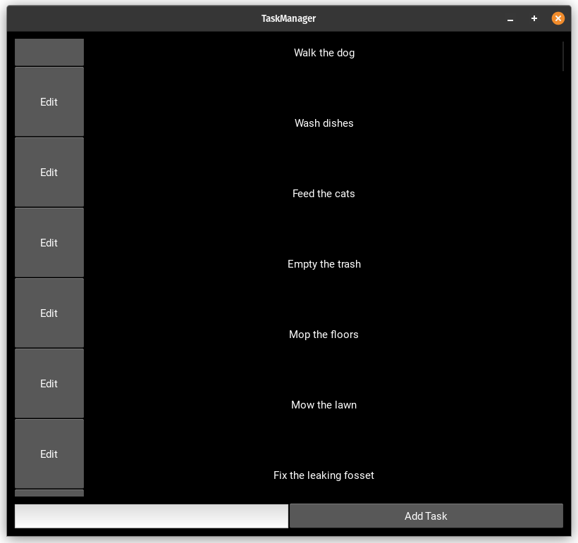
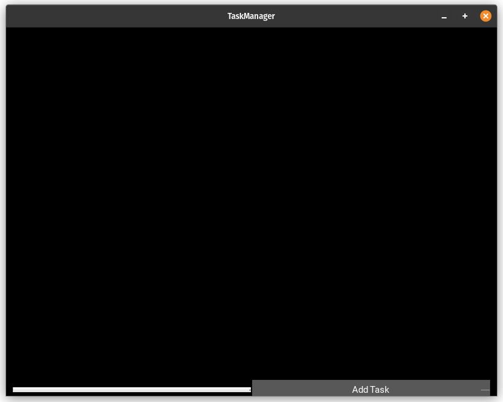
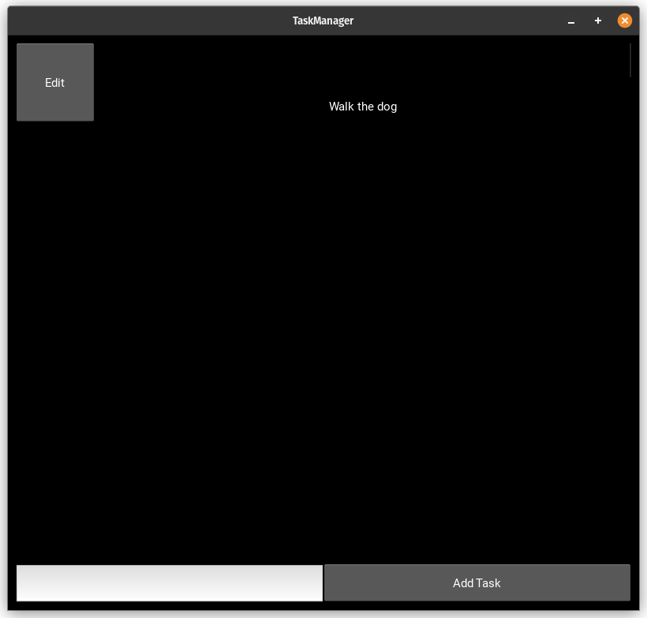
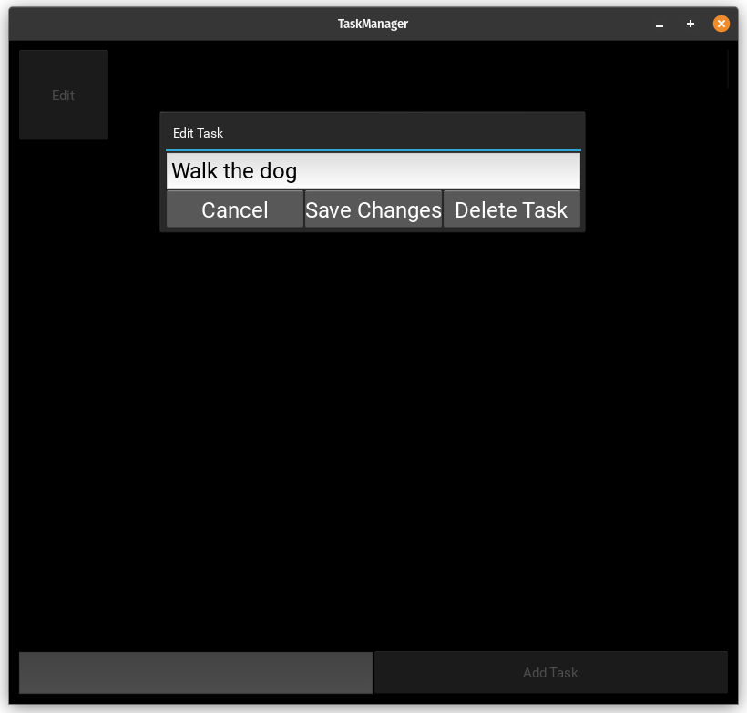
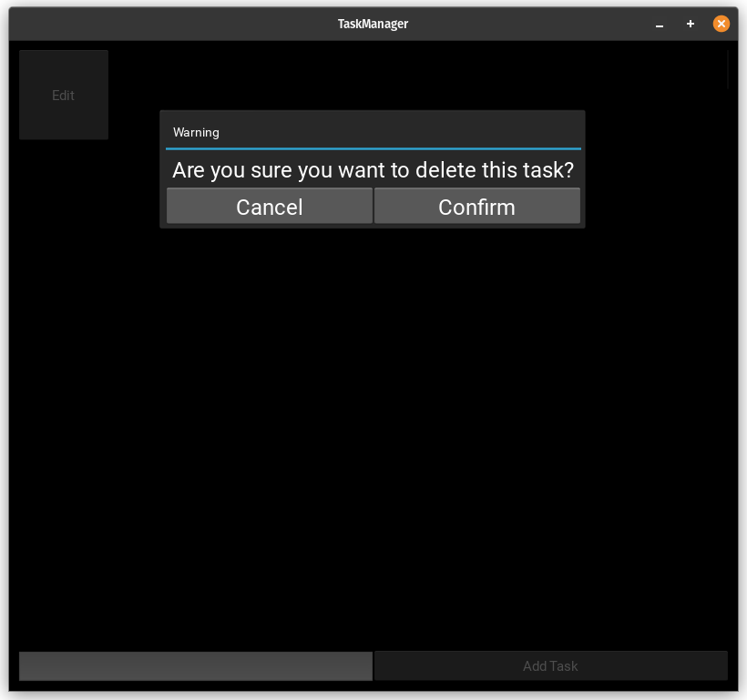

Application Usage
=================

The application is used to store basic tasks that needs to be done later.
Tasks can be added, modified, and deleted.
They are saved in a database, as well as the log for every action that happens.

Running the application
-----------------------

To run the application, simply run the "Main.py" script from the root directory using python:

.. code-block:: console

    $ python3 Main.py

The first time the application is oppened, it is going to be empty:

    
Task Creation
-------------

To add a new task, simply input the task description into the input field at the bottom and press the "add task" button.

The task will appear in the application body

Editing or Deleting a Task
--------------------------

To edit a task, click on the "Edit" button.

A popup will appear, with a text field and three buttons:

The text field contains the Task Description.
The cancel button drops the modifications.
The save button saves all changes and updates the data.
The delete button will delete the task and update the data.

When saving or deleting a task, another popup will appear to confirm the action, giving the user a chance to cancel in case they made a mistake.

