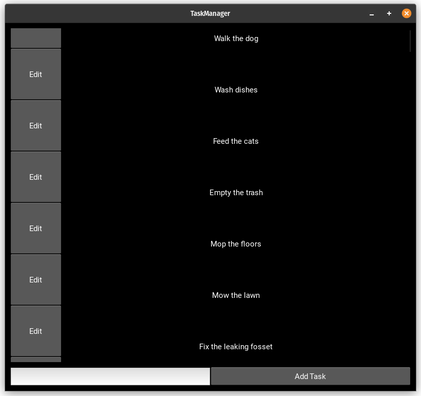

Assignment 04 documentation
===========================

Introduction
------------
This documentation covers all python scrips from the Assignment 04 of the Database Application Development class.
The application is a simple ToDo list that connects to a MySQL database to store it's information. developped in Python using Kivy for it's frontend.

.. toctree::
   :maxdepth: 2
   :caption: Contents:

   Installation
   Usage
   Main
   Logic
   DB